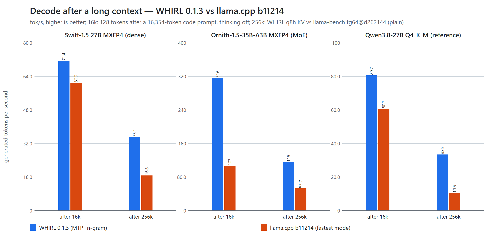

[English](../README.md) | **繁體中文**

# WHIRL

**Windows HIP Inference for RDNA LLMs**

WHIRL 是 AMD Radeon AI PRO R9700（RDNA 4）在 Windows 上的 LLM 推論引擎。

**WHIRL 的設計理念**
1. **專為 Windows 上的 AMD GPU 打造**：原生 Windows 的 C++／HIP 推論引擎，針對 RDNA 架構逐一手寫、調校 kernel。不需要 WSL、Docker 或 Linux 虛擬機，裝好 AMD 驅動就能跑。
2. **完整開源，包含每一支 kernel**：從 host 端排程到 GPU kernel，全部原始碼以 Apache-2.0 公開，沒有封閉的二進位元件。歡迎回報問題、提供量測數據，或直接貢獻程式碼，一起把 AMD 在 Windows 上的推論做到最好。
3. **精度優先於速度**：所有加速手段，包括投機解碼、多人合批、prefix cache、快取還原，輸出都和單純 greedy 解碼逐位元相同，而且有常駐測試把關。WHIRL 不會在你選擇的模型之外，再額外犧牲精度去換速度。
4. **少數模型，做到極致**：不追求「什麼模型都能跑」，而是針對特定模型與硬體，把效能推到接近硬體極限。支援的架構一個一個加，每加一個就做到最好。
5. **數字透明、可驗證**：所有效能數字都是實測，量測方法、指令和原始數據全部公開。投機解碼這類效果會隨內容變化的功能，同時列出最適用場景、主要場景和最差情況，讓你知道自己的用法會落在哪裡。
6. **為真實工作流程設計**：以 coding agent 和長上下文為核心場景：長 prompt 快速處理、多人同時使用時主對話不卡頓、VRAM → RAM → SSD 三層快取，server 重啟後對話也能接回來。

目前支援的架構是 **`qwen35`**（dense）與 **`qwen35moe`**（混合專家，MoE），之後會逐一加入更多架構。WHIRL 依循 [NInfer](https://github.com/Neroued/ninfer)（Apache-2.0）的設計理念——為選定的模型與選定的 GPU 打造，盡可能逼近硬體極限；[zynfer](https://github.com/thanos/zynfer) 把同樣的想法帶到了 RDNA 4。

## WHIRL 對 llama.cpp：一眼看

同一個 GGUF 檔、同一組提示、同一張 R9700、greedy 解碼；llama.cpp b11214（ROCm），每一列都用我們找到最快的旗標。WHIRL 的每一項加速，輸出都與單純 greedy 解碼逐位元相同（[為什麼](#變快但答案不變)）。

| | Swift-1.5 27B MXFP4-A（dense） | Ornith-1.5-35B-A3B MXFP4（MoE） |
|---|---|---|
| Decode tok/s，寫程式提示 | 112.4 vs 60.8（**1.85×**） | 257.6 vs 118.8（**2.17×**） |
| 伺服器 4 人同時使用，總吞吐 tok/s | 182.1 vs 64.0（**2.84×**） | 381.1 vs 176.8（**2.16×**） |
| Prefill tok/s，8k token 提示 | 3,469 vs 1,338（**2.59×**） | 11,258 vs 4,637（**2.43×**） |
| Prefill tok/s，32k token 提示 | 2,907 vs 1,174（**2.48×**） | 8,633 vs 3,778（**2.29×**） |
| Prefill tok/s，128k token 提示 | 1,757 vs 791.3（**2.22×**） | 4,311 vs 2,239（**1.93×**） |
| Prefill tok/s，256k token 提示 | 969.8 vs 556.1（**1.74×**）¹ | 2,135 vs 1,442（**1.48×**）¹ |
| 256k token 提示之後的 decode tok/s | 35.1 vs 16.8（**2.09×**）¹ | 115.6 vs 53.7（**2.15×**）¹ |
| 首 token 時間：重用 26k token 的系統提示 | 0.108 秒 vs 0.384 秒（**3.6×**） | 0.098 秒 vs 0.182 秒（**1.9×**） |

¹ KV 快取：WHIRL 為 int8（q8h）/ llama.cpp 為 f16；llama.cpp 在 256k 是一般 decode，沒有投機解碼。


完整表格（含 Qwen3.8 Q4_K_M，以及 WHIRL 領先*不多*的地方）：[效能](#效能)。

## 變快，但答案不變

WHIRL 的每一項加速，都經過檢查：**產生的 token 與同一個模型檔的單純 greedy 解碼逐位元相同**。

| 加速手段 | 保證 | 怎麼檢查 |
|---|---|---|
| MTP 與 n-gram 投機解碼| 驗證後的輸出與單純 greedy 解碼逐位元相同| 內建自我檢查 `whirl selftest`（用模型自己的權重比對多列 kernel 與單列）、kernel 測試、伺服器 gate |
| 多位使用者合併批次 | 每個請求的輸出與單獨執行時逐位元相同| kernel 測試（GEMM 與 attention 不受批次列數影響）、伺服器 gate |
| 共用系統提示與共用前綴的快取命中 | 與從頭處理這個提示逐位元相同（檢查點放在提示自身的 chunk 排程點上） | 伺服器 gate |
| 從主記憶體或 SSD 層還原 session | 與存入時的狀態逐位元組相同| 寫出時逐位元組比對（`TIER_VERIFY`）、伺服器 gate |

為了變快，WHIRL **不做**的事：KV 快取不低於 8 bit（不用 4-bit KV）、不把模型權重重新量化成更少的 bit（只有草稿用的 MTP 與草稿頭副本會這樣做，而草稿不會改變輸出）、不用 fp8 attention。

精確地說，這代表：

- **權重**就是您選用的 GGUF；量化方式是模型檔作者的選擇，WHIRL 照檔案存的內容計算。
- **KV 快取**預設為 f16。dense 模型在 f16 放不下長上下文時，伺服器會改用 int8：先 `q8v`（key 為 f16、value 為 int8），再 `q8h`（key 與 value 都是 int8）；MoE 模型維持 f16。可用 `WHIRL_KV` 固定格式。兩者與未量化的模型相比，在數值上都有損失，就像任何量化推論一樣。WHIRL 不宣稱「零損失」。
- **接續一段對話**時，會重用上一輪算出的 KV 與 DeltaNet 狀態（包含 decode 生成的 token）。它們來自 decode kernel （以及不同的 chunk 切法），與「把整段歷史當成一個提示重新處理」在數值上等價，但不是逐位元相同；差異已記錄並量測（[kv-and-caching.md](guide/zh-TW/kv-and-caching.md)）。
- MXFP4 檔以**速度模式**執行：prefill 時 MXFP4 矩陣乘法使用 fp8 activation，DeltaNet prefill 的部分步驟使用 f16。decode 與驗證在兩種模式下都走同一條 int8 路徑，所以上述保證在兩種模式下都成立。

## 需求

| 項目 | 內容 |
|---|---|
| GPU | **AMD Radeon AI PRO R9700**（RDNA 4，gfx1201，32 GB）——必要；只支援單張 GPU |
| 作業系統 | **Windows 11**，64 位元 |
| 驅動程式 | **AMD Software: Adrenalin Edition 26.8.1**（驅動程式 32.0.31041.1004）或更新版 |
| 執行| 只需要驅動程式（它會安裝 `amdhip64_7.dll` 與 `amd_comgr_3.dll`）。不用 HIP SDK、不用 ROCm、不用 Visual C++ runtime |
| 從原始碼建置 | HIP SDK 7.2 + Visual Studio 2022 Build Tools（MSVC）+ CMake + Ninja——見[從原始碼建置](building_zh-TW.md) |
| 記憶體 / 磁碟 | 預設設定下，伺服器會為主記憶體快取層 pin 住約四分之一的主記憶體（8～32 GiB；64 GB 的電腦為 16 GiB），SSD 快取層最多使用 64 GiB；兩者都可調整或關閉（`--kv-ram-mb`、`--kv-ssd-gb`） |

我們的測試機以 USB4 / Thunderbolt eGPU 連接 R9700，可以正常使用。插在主機板 PCIe 插槽上的顯示卡，數字可能略有不同（主要是資料要經過主機連結的部分，例如載入模型、主記憶體 / SSD 快取層）。

目前還不支援其他 AMD GPU。RX 9070 系列的晶片相同（gfx1201），但只有 16 GB，對這些 27B / 35B 模型大概不夠（未測試）。Radeon 8060S（Ryzen AI Max+ 395，gfx1151）的支援在 [`gfx1151` 分支](https://github.com/tsaipifong/whirl-llm/tree/gfx1151) 開發中。

## 快速上手

1. 從 [Releases](https://github.com/tsaipifong/whirl-llm/releases) 下載 `whirl-0.1.3-windows-x64.zip`，以及一個 [支援的模型](#支援的模型)。
2. 在 PowerShell 執行：

```powershell
Unblock-File .\whirl-0.1.3-windows-x64.zip
Expand-Archive .\whirl-0.1.3-windows-x64.zip -DestinationPath C:\whirl
cd C:\whirl\whirl-0.1.3-windows-x64
.\whirl.exe devices                                    # 應該會列出 AMD Radeon AI PRO R9700 (gfx1201)
.\whirl.exe chat C:\models\Swift-1.5-Qwen3.8-27B-MXFP4-A-outQ6_K.gguf "用兩句話說明 TCP 慢啟動（slow start）。" --max-tokens 400
.\whirl-server.exe C:\models\Swift-1.5-Qwen3.8-27B-MXFP4-A-outQ6_K.gguf --port 8080
```

伺服器在 `http://127.0.0.1:8080/v1` 提供 OpenAI API（`/v1/chat/completions`、`/v1/completions`、`/v1/models`、`/health`），任何 OpenAI 相容的用戶端都能用。按 Ctrl+C 停止；快取的 session 會先寫入 SSD 層。

處理長文件時，可以給每個 slot 更長的 context，例如 `--ctx-per-slot 262144`（每個請求 256k token），見 [情境食譜](recipes_zh-TW.md#long-context)。

第一次使用某個模型時會先調校一次 GPU kernel——27B Q4_K_M 約 1.5 分鐘，MXFP4 檔只要幾秒——結果快取在 `%LOCALAPPDATA%\whirl`。完整步驟：[快速上手](quickstart_zh-TW.md)。所有選項：[使用參考](guide/zh-TW/usage.md)。

## 支援的模型

WHIRL 讀取 GGUF 的 `general.architecture`，只接受 `qwen35` 與 `qwen35moe`（Gated DeltaNet + gated attention 的混合架構，可帶 MTP 層），以及保留這個架構的微調模型。其他架構（Llama、Gemma、Mistral、DeepSeek、`qwen3`、`qwen2` 等）會在載入時被拒絕並顯示清楚的訊息；WHIRL 沒有 kernel 的 tensor 型別（例如 NVFP4）也一樣，不會退回某條很慢的泛用路徑。

> **推薦：我們自己量化的 MXFP4 檔效能最好。**
> - Dense 27B：[**Swift-1.5-Qwen3.8-27b-MXFP4-GGUF**](https://huggingface.co/tsaipifong/Swift-1.5-Qwen3.8-27b-MXFP4-GGUF)，A 版（`Swift-1.5-Qwen3.8-27B-MXFP4-A-outQ6_K.gguf`）。Swift-1.5 的思考也比原模型精簡得多（在我們的中英混合程式提示上，思考 token 少 44%）。
> - MoE 35B（約 3B 啟用）：**Ornith-1.5-35B-A3B MXFP4**：[tsaipifong/Ornith-1.5-35B-A3B-MXFP4-GGUF](https://huggingface.co/tsaipifong/Ornith-1.5-35B-A3B-MXFP4-GGUF)。

測試過的 GGUF 檔（可載入、greedy 輸出已檢查、MTP 輸出與一般 greedy 相同，並在 R9700 上量測過）：

| 模型檔（Hugging Face） | 類型 | 架構 | 量化 | 模式 |
|---|---|---|---|---|
| [tsaipifong/Swift-1.5-Qwen3.8-27b-MXFP4-GGUF](https://huggingface.co/tsaipifong/Swift-1.5-Qwen3.8-27b-MXFP4-GGUF) `…-A-outQ6_K.gguf`（推薦）、`…-B-outQ8_0.gguf`、`…-C-outQ4_K.gguf` | dense 27B | qwen35 | MXFP4（+ Q8_0 MTP / embedding） | 速度模式；我們為 WHIRL 量化 |
| [unsloth/Qwen3.8-27B-GGUF](https://huggingface.co/unsloth/Qwen3.8-27B-GGUF) `Qwen3.8-27B-UD-Q4_K_M.gguf` | dense 27B | qwen35 | UD-Q4_K_M | 精確模式 |
| [FreedomAISVR/Qwen3.8-27B-MXFP4-GGUF](https://huggingface.co/FreedomAISVR/Qwen3.8-27B-MXFP4-GGUF) `qwen3.8-27b-mxfp4.gguf` | dense 27B | qwen35 | MXFP4 | 速度模式 |
| [`Ornith-1.5-35B-A3B-MXFP4.gguf`](https://huggingface.co/tsaipifong/Ornith-1.5-35B-A3B-MXFP4-GGUF)（我們量化） | MoE 35B，約 3B 啟用 | qwen35moe | MXFP4 專家與 dense（+ Q8_0 MTP / embedding、Q6_K head） | 速度模式（專家 prefill 走 fp8） |
| [ornith-ai/Ornith-1.5-35B-A3B-GGUF](https://huggingface.co/ornith-ai/Ornith-1.5-35B-A3B-GGUF) `Ornith-1.5-35B-Q4_K_M.gguf` | MoE 35B，約 3B 啟用 | qwen35moe | Q4_K_M | 精確模式 |

圖片輸入搭配 Qwen3-VL 形式的 mmproj（F16 / BF16），以 `--mmproj` 指定；已用上表的 27B 檔測試。其他 `qwen35` / `qwen35moe` GGUF 應該可以載入，但未經測試。如何選擇與製作 GGUF：[quantization.md](guide/zh-TW/quantization.md)。

## 效能

WHIRL 0.1.3 對 llama.cpp b11214（ROCm，每一列都用我們找到最快的旗標），R9700，greedy 解碼，兩個引擎用相同的 GGUF 檔與相同的提示。decode 數字先報 WHIRL 的預設模式 **MTP + n-gram**；標示 **no MTP** 的列比較的是不用投機解碼的一般 decode。每一列都註明 KV 快取格式。

主角是我們的 MXFP4 檔（Swift-1.5 27B 與 Ornith-1.5-35B-A3B）；Qwen3.8-27B UD-Q4_K_M 只列為參考。96k token 起，每一格都標出兩個引擎實際用的 KV 格式，寫法是「KV WHIRL / llama.cpp」。




| R9700，greedy——WHIRL 對 llama.cpp（倍數） | Swift-1.5 27B MXFP4-A（dense） | Ornith-1.5-35B-A3B MXFP4（MoE，約 3B 啟用） | Qwen3.8-27B UD-Q4_K_M（dense，參考） |
|---|---|---|---|
| Decode tok/s，7 個寫程式提示（800 token）——WHIRL MTP+n-gram 對 llama.cpp 最快¹ | 112.4 vs 60.8（1.85×） | 257.6 vs 118.8（2.17×） | 97.3 vs 56.0（1.74×） |
| 16k token context 之後的 decode tok/s——WHIRL MTP+n-gram 對 llama.cpp 最快¹ | 71.4 vs 60.9⁴（1.17×） | 316.4 vs 106.9⁴（2.96×） | 80.7 vs 60.7⁴（1.33×） |
| Decode tok/s，同樣 7 個提示——WHIRL **no MTP** 對 llama.cpp **no MTP** | 38.1 vs 33.4（1.14×） | 177.4 vs 118.8（1.49×） | 34.8 vs 30.9（1.13×） |
| 伺服器 4 人並發總吞吐 tok/s（含 prefill）——WHIRL MTP+n-gram 對 llama.cpp 最快¹ | 182.1 vs 64.0⁴（2.84×） | 381.1 vs 176.8⁴（2.16×） | 122.4 vs 57.1⁴（2.14×） |
| Prefill tok/s，8k token 提示（各自的 CLI bench 工具） | 3,469 vs 1,338（2.59×） | 11,258 vs 4,637（2.43×） | 1,731 vs 1,223（1.42×） |
| Prefill tok/s，32k token 提示 | 2,907 vs 1,174（2.48×） | 8,633 vs 3,778（2.29×） | 1,570 vs 1,086（1.45×） |
| Prefill tok/s，96k token 提示 | 2,021.1 vs 886.7（2.28×）；KV f16 / f16 | 5,183.5 vs 2,602.6（1.99×）；KV f16 / f16 | 1,266.4 vs 837.3（1.51×）；KV f16 / f16 |
| Prefill tok/s，128k token 提示 | 1,757 vs 791.3（2.22×）；KV f16 / f16 | 4,311 vs 2,239（1.93×）；KV f16 / f16 | 1,158 vs 752.0（1.54×）；KV f16 / f16 |
| **Prefill tok/s，256k token 提示** | 969.8 vs 556.1（1.74×）；KV q8h / f16 | 2,135.2 vs 1,442.2（1.48×）；KV q8h / f16 | 742.2 vs 516.4（1.44×）；KV q8h / q8_0 |
| **256k token 提示之後的 decode tok/s**——WHIRL MTP+n-gram 對 llama.cpp 一般 decode³ | 35.1 vs 16.8（2.09×）；KV q8h / f16 | 115.6 vs 53.7（2.15×）；KV q8h / f16 | 33.5 vs 10.5（3.19×）；KV q8h / q8_0 |
| 首 token 時間：新對話重用 26k token 的系統提示（秒，越低越好） | 0.108 vs 0.384⁴（3.6×） | 0.098 vs 0.182⁴（1.9×） | 0.121 vs 0.369⁴（3.0×） |
| 首 token 時間：伺服器重啟後的 26k token session（從 SSD 層還原） | 0.613 s vs N/A² | 0.318 s vs N/A² | 0.672 s vs N/A² |

¹ 該列 llama.cpp 在 plain / MTP / MTP + n-gram 中最快者。

² llama.cpp 沒有自動的持久化 KV 快取。

³ llama-bench `tg64@d262144`：在 262,144 token 的 context 之後生成 64 個 token，一般 decode，沒有投機解碼。llama.cpp 跑 Swift-1.5 MXFP4 256k 用的是 f16 KV（放得下，31.3 GB）；Ornith-1.5 在 96k 與 256k 也是 f16 KV；Qwen3.8 Q4_K_M 256k 用 f16 會溢到共用記憶體，所以改用 q8_0 KV。

⁴ llama.cpp 為 v0.1.3 用與 WHIRL 相同的提示重量；採用的模式（量到的最快者）：16k 之後的 decode：Swift-1.5 MTP + n-gram、Ornith-1.5 plain、Qwen3.8 MTP + n-gram；4 人並發：Swift-1.5 plain、Ornith-1.5 plain、Qwen3.8 plain；26k 系統提示 TTFT：只量 plain（回答只有 1 個 token，投機解碼用不上）。

**投機解碼：最適用、主要、最差情況**——Swift-1.5 27B MXFP4-A，WHIRL 預設的 MTP + n-gram 對不開投機解碼；輸出逐位元相同：

| | 最適用：檔案編輯（內容重複） | 主要：coding agent 工作階段 | 長文件問答（引用多，128k 之後） | 最差：128k 之後寫全新內容（沒有可照抄的內容） |
|---|---|---|---|---|
| Decode tok/s，MTP + n-gram | 174.4 | 92.9 | 87.6 | 39.4 |
| Decode tok/s，不開投機解碼 | 39.1 | 32.8 | 25.3 | 25.2 |
| 加速倍數 | 4.47× | 2.83× | 3.47× | 1.56× |
| 每個 cycle 的 token 數 | 6.19 | — | 6.45 | 1.76 |

**int8 KV（q8h）的長上下文**——WHIRL 伺服器、單人、`--ctx-per-slot 262144`、q8h KV（key 與 value 存成 int8；query 與 key 先做 Hadamard 旋轉），這是 dense 模型跑 256k token 時使用的設定（MoE 模型以 `WHIRL_KV=q8h` 指定）：

| WHIRL 伺服器，q8h KV，單人 | Swift-1.5 27B MXFP4-A | Ornith-1.5-35B-A3B MXFP4 | Qwen3.8-27B UD-Q4_K_M（參考） |
|---|---|---|---|
| Prefill tok/s，64k token 提示 | 2,162.0 | 5,671.3 | 1,289.9 |
| Prefill tok/s，128k token 提示 | 1,533.0 | 3,673.6 | 1,032.2 |
| Prefill tok/s，192k token 提示 | 1,212.2 | 2,770.7 | 876.6 |
| Prefill tok/s，256k token 提示 | 969.8 | 2,135.2 | 742.2 |
| 128k 之後的 decode tok/s（MTP+n-gram） | 62.5 | 214.0 | 58.3 |
| 256k 之後的 decode tok/s（MTP+n-gram） | 35.1 | 115.6 | 33.5 |
| 長文問答粗略檢查（回答有提到被問的函式；不是正式 needle 測試） | 128k ✓ / 256k ✓ | 128k ✓ / 256k ✓ | 128k ✓ / 256k ✓ |

WHIRL 領先**不多**的地方：dense 模型的一般 decode（不開 MTP）兩邊都受記憶體頻寬限制（llama.cpp 的 1.13–1.14×）；16k token context 之後的 decode，dense 模型只快 1.17×（Swift-1.5）與 1.33×（Qwen3.8）；Qwen3.8 Q4_K_M 的 prefill 領先較少（96k 為 1.51×、256k token 為 1.44×，Swift-1.5 MXFP4 是 2.28× 與 1.74×）；Ornith-1.5 在 256k 的 prefill 領先 1.48×；投機解碼的最差情況（128k token 之後寫全新內容，沒有可照抄的內容）只快 1.56×。我們的 R9700 是 USB4 eGPU；prefill 與 decode 都在 VRAM 內，但還原與載入模型會經過主機連結。

完整方法與所有數字：[benchmarks.md](guide/zh-TW/benchmarks.md)。

## v0.1.0 → v0.1.3 增強了什麼

兩個版本在同一台機器上，用同一個 GGUF 檔與同一組提示量測；兩版的 greedy 輸出逐位元相同。

| Swift-1.5 27B MXFP4-A，R9700 | v0.1.0 | v0.1.3 | 變化 |
|---|---|---|---|
| Prefill tok/s，32k token 提示（f16 KV） | 2,605.3 | 2,907.4 | +11.6% |
| Prefill tok/s，128k token 提示（f16 KV） | 1,407.3 | 1,756.7 | +24.8% |
| Prefill tok/s，128k token 提示（q8h KV，伺服器） | 1,352.7 | 1,533.0 | +13.3% |
| Prefill tok/s，256k token 提示（q8h KV，伺服器） | 832.5 | 969.8 | +16.5% |
| 128k token 文件問答的 decode tok/s（回答大量引用文件） | 63.7 | 87.6 | +37.5% |
| Decode tok/s，寫程式提示 | 110.7 | 120.7 | +9.1% |
| KV 池容量，預設 4 個 slot（token） | 210,688 | 226,304 | +7.4% |
| 4 人短提示同時送出：整批完成時間（秒，越低越好） | 9.57 | 8.62 | −9.9% |
| 長上下文 coding agent 請求的 decode tok/s（agent 工作階段 3 第 143 步，127.9k token） | 53.7 | 75.2 | +40.0% |
| agent 工作階段 3 到該請求為止的 decode tok/s（144 個請求平均） | 64.9 | 81.7 | +25.9% |

v0.1.2 參考值（同一台機器、輸出相同）：127.9k 那個請求 53.5 tok/s，整段 65.0 tok/s；提升來自 v0.1.3。

## Windows 安全性提示

`whirl.exe` 與 `whirl-server.exe` 沒有程式碼簽章。剛下載的檔案可能讓 Windows SmartScreen 顯示「Windows 已保護您的電腦」：按 **其他資訊 → 仍要執行**，或在解壓縮前先對 zip 執行 `Unblock-File`（只對從官方發布頁下載、且已核對 SHA-256 的 zip 這樣做）。**智慧型應用程式控制**設為*開啟*時，Windows 可能直接封鎖程式，而且沒有「仍要執行」選項。詳見 [Windows 安全性提示](windows_security_zh-TW.md)。

## 文件

| | 繁體中文 | English |
|---|---|---|
| 快速上手 | [quickstart_zh-TW.md](quickstart_zh-TW.md) | [quickstart.md](quickstart.md) |
| 情境食譜：接上用戶端、長時間 agent 工作階段、長上下文、多使用者、圖片、看懂 log、疑難排解 | [recipes_zh-TW.md](recipes_zh-TW.md) | [recipes.md](recipes.md) |
| 使用參考（所有指令、選項、環境變數、結束代碼） | [usage.md](guide/zh-TW/usage.md) | [usage.md](usage.md) |
| 伺服器（API、取樣、工具呼叫、批次、decode 保底、log） | [server.md](guide/zh-TW/server.md) | [server.md](guide/en/server.md) |
| 與 llama.cpp 的效能比較 | [benchmarks.md](guide/zh-TW/benchmarks.md) | [benchmarks.md](benchmarks.md) |
| Windows 安全性提示 | [windows_security_zh-TW.md](windows_security_zh-TW.md) | [windows_security.md](windows_security.md) |
| 從原始碼建置 | [building_zh-TW.md](building_zh-TW.md) | [building.md](building.md) |
| 指南首頁| [index.md](guide/zh-TW/index.md) | [index.md](guide/en/index.md) |
| 架構 | [architecture.md](guide/zh-TW/architecture.md) | [architecture.md](guide/en/architecture.md) |
| Kernel | [kernels.md](guide/zh-TW/kernels.md) | [kernels.md](guide/en/kernels.md) |
| 投機解碼（MTP + n-gram） | [speculative-decoding.md](guide/zh-TW/speculative-decoding.md) | [speculative-decoding.md](guide/en/speculative-decoding.md) |
| KV 快取、前綴快取、分層快取 | [kv-and-caching.md](guide/zh-TW/kv-and-caching.md) | [kv-and-caching.md](guide/en/kv-and-caching.md) |
| 量化與模型檔 | [quantization.md](guide/zh-TW/quantization.md) | [quantization.md](guide/en/quantization.md) |
| 圖片輸入 | [vision.md](guide/zh-TW/vision.md) | [vision.md](guide/en/vision.md) |
| Windows 上的 HIP | [windows-hip.md](guide/zh-TW/windows-hip.md) | [windows-hip.md](guide/en/windows-hip.md) |
| 量測方法 | [benchmarking.md](guide/zh-TW/benchmarking.md) | [benchmarking.md](guide/en/benchmarking.md) |
| **踩坑全集**（125 條，每條都有：症狀 → 根本原因 → 修正 → 檢查） | [pitfalls.md](guide/zh-TW/pitfalls.md) | [pitfalls.md](guide/en/pitfalls.md) |

## 開發與 AI 協助

WHIRL 是在專案擁有者（[@tsaipifong](https://github.com/tsaipifong)）的指導下，由 Anthropic 的 AI 模型 **Claude Opus 5.5** 參與設計、實作、最佳化與量測。Anthropic 與本專案沒有隸屬關係，也不為本專案背書。

## 授權與致謝

Apache License 2.0；見 [LICENSE](../LICENSE) 與 [NOTICE](../NOTICE)。第三方素材列在 [THIRD_PARTY_NOTICES.md](../THIRD_PARTY_NOTICES.md)，每個原始檔的來源列在 [PROVENANCE.md](../PROVENANCE.md)。

- [NInfer](https://github.com/Neroued/ninfer)——WHIRL 依循的設計理念（只借理念）。
- [llama.cpp / ggml](https://github.com/ggml-org/llama.cpp)——我們量測時的比較基準，也是 GGUF 與量化格式相容性的參考；少數改寫的部分（tokenizer 預切詞 / BPE 迴圈、查表、圖片前處理）採 MIT 授權，列在 THIRD_PARTY_NOTICES.md。
- [gufo](https://github.com/gufo-org/gufo) 與 [r9700-stack](https://github.com/bkvargyas/r9700-stack)——量測方法與最佳化想法。
- 模型作者：Qwen 團隊（Qwen3.8）、[unsloth](https://huggingface.co/unsloth)、[FreedomAISVR](https://huggingface.co/FreedomAISVR)、[ornith-ai](https://huggingface.co/ornith-ai)（Ornith-1.5），以及 [ukisai](https://huggingface.co/ukisai/Swift-1.5-Qwen3.8-27b)（Swift-1.5，我們的 MXFP4 檔就是由它量化而來）。
