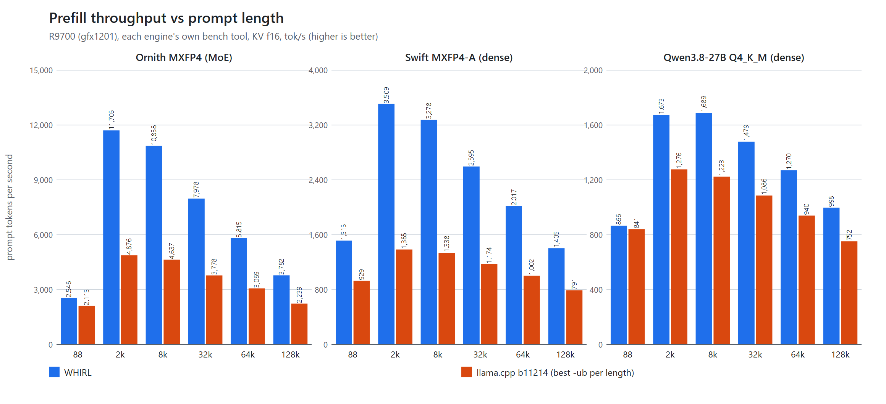
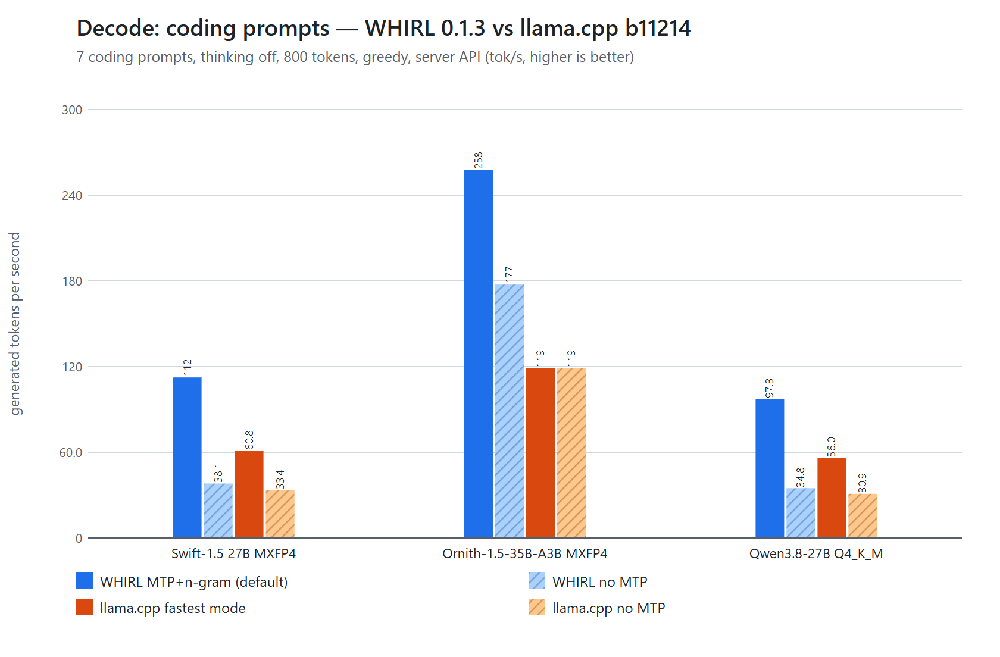
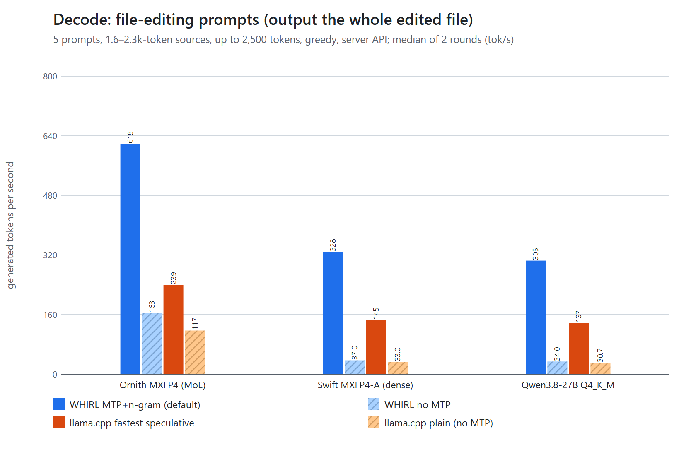
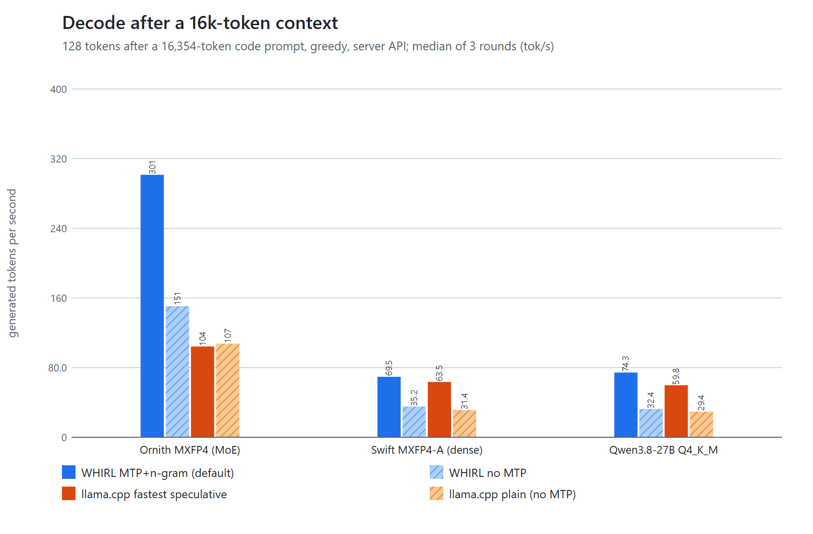
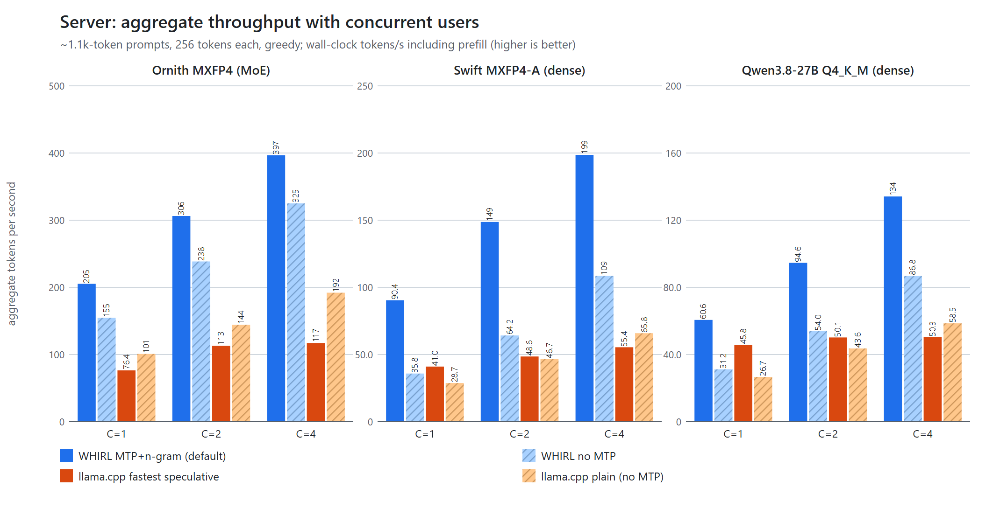
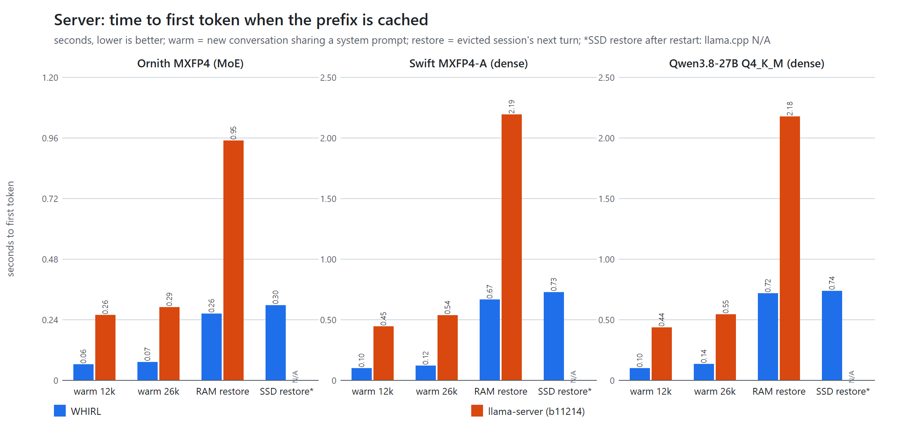

[English](../../benchmarks.md) | **繁體中文**

# WHIRL 發行版效能評測（v0.1.0）— Radeon AI PRO R9700 上 WHIRL 對 llama.cpp

本頁所有 WHIRL 數字都用目前 repository 自建的 C++ `whirl.exe`／`whirl serve`（v0.1.0 候選版）量測，並與發行執行檔交叉驗證（§11）。llama.cpp 為 **b11214**（ROCm，commit `2ebd9ae62`），每一列都用我們找到最快的旗標（§2.3）。兩邊用同樣的提示、同樣的 context 長度、greedy 解碼，GPU 上一次只有一個模型程序。

**WHIRL 沒有領先或領先很小的地方（請先看）：**

- **Q4_K_M 的短提示：** 88 token 的 prefill 幾乎打平（1.03×）。
- **不用推測解碼的純 decode** 兩邊都受記憶體頻寬限制；dense 模型上 WHIRL 只快 1.10–1.18×。WHIRL 大部分的 decode 領先來自 MTP + n-gram 推測解碼。
- **Swift MXFP4-A 在 16k context 之後的 decode：** WHIRL MTP+n-gram 只有 llama.cpp 最佳設定（MTP 加 q8_0 V cache）的 1.09×，而且在這個模型上 WHIRL 的 MTP+n-gram 比它自己的純 MTP 還*慢*（69.5 vs 72.4 tok/s）。
- **VRAM：** 同樣 context 下，dense 模型的 WHIRL CLI 比 llama-bench *多用* 3–5 GiB（MoE 模型在 128k 多 1.4 GiB；較大的 prefill 緩衝、MTP 區塊與 draft head）。WHIRL server 依設計會用 KV pool 填滿剩餘 VRAM（§9）。
- **Q4_K_M 的冷 prefill TTFT** 只快 1.5×（MXFP4 模型約 2.5×）。

## 1. 測試環境

| | |
|---|---|
| GPU | AMD Radeon AI PRO R9700（gfx1201，RDNA 4，32 GB GDDR6），**以 USB4 外接（eGPU）** |
| 主機 | ASUS ROG Flow Z13（GZ302EA）：AMD Ryzen AI MAX+ 395（16 核／32 緒），128 GB LPDDR5X-8000，其中 Windows 可用 63.6 GB（其餘保留給內建 Radeon 8060S，測試時閒置） |
| 作業系統 | Windows 11 家用版，build 26300 |
| GPU 驅動 | AMD Software Adrenalin 26.8.1，驅動 32.0.31041.1004 |
| WHIRL 建置 | HIP SDK 7.2（裝置端）、MSVC 19.44（主機端）、CMake + Ninja、`-DWHIRL_GPU_ARCHS=gfx1201`、Release；`whirl.exe` SHA-256 `13701a20edc3953b48288f7ad5b721eb1549e059f948fa18c00a15a73843f79a` |
| 發行版交叉驗證 | `whirl.exe` 0.1.0（靜態 CRT）SHA-256 `a9fa53323d20f2ac49cb3c8882c75944ab871b54375699455f20cf19504e6366`、`whirl-server.exe` `9a15e49173e1e2e69df59d9ff20e958ae0e174d1f043faf8783a8173ab332326`（§11） |
| llama.cpp | b11214 ROCm Windows 版（`llama-bench`、`llama-server`、`llama-mtmd-cli`），`HIP_VISIBLE_DEVICES=1`、`GGML_CUDA_NO_PINNED=1` |
| 量測時間 | 2026-10-03 01:45–08:55（本地時間） |

**eGPU 說明（環境限制，只在此說明一次，未針對它最佳化）：** R9700 接在 USB4 後面（主機連線每方向約 3.8 GB/s）。這會影響兩個引擎的模型載入時間、主機 RAM／SSD 的 KV 還原與 vision 權重串流；prefill 與 decode 都在 VRAM 內，不受影響。直接插 PCIe 的系統，§8 的還原時間應該會更快。

### 模型

| 簡稱 | 檔案 | 類型 | 量化 |
|---|---|---|---|
| Ornith MXFP4（MoE） | `Ornith-1.5-35B-A3B-MXFP4.gguf`（18.4 GiB） | MoE，總參數 35B，每 token 約 3B active，含 MTP head | MXFP4 專家（WHIRL 自己發佈的量化） |
| Swift MXFP4-A（dense） | `Swift-1.5-Qwen3.8-27B-MXFP4-A-outQ6_K.gguf`（14.7 GiB） | dense 27B，含 MTP head | MXFP4，輸出 head Q6_K（A 版，我們發佈並推薦的量化） |
| Qwen3.8-27B Q4_K_M（dense） | `Qwen3.8-27B-UD-Q4_K_M.gguf`（15.3 GiB，unsloth） | dense 27B，含 MTP head | 標準 Q4_K_M（unsloth UD） |

## 2. 方法

### 2.1 規則

- **GPU 上一次只有一個模型程序**，每次執行都持有本機的 R9700 鎖；只用專用 VRAM（背景每 2 秒記錄每個引擎程序的專用／共用 GPU 記憶體）。所有 llama.cpp 與 WHIRL CLI 程序的共用記憶體都 ≤ 314 MiB（whirl-vis 的約 0.9 GiB 是宣告過的 pinned 投影器權重）。WHIRL server 程序顯示 8–16 GiB「共用」——那是宣告過的 pinned 主機 RAM KV 層（`--kv-ram-mb`），不是溢出的 VRAM。
- **兩邊都用 greedy 解碼。** server 請求用與 greedy 等價的取樣設定 `top_k = 1、temperature 1.0、top_p 1.0、min_p 0、seed 42`（兩個 server 走同一條取樣路徑），除快取測試外 `cache_prompt = false`。WHIRL 推測解碼的輸出與 plain greedy 相同（每輪都驗證：210 個輸出跨輪 0 個不同）。
- **重複次數：** whirl bench 3 個行程（與 llama-bench 交錯），server 情境 3 輪（檔案編輯、併發、快取為 2 輪），WHIRL／llama.cpp 交錯、先正序再反序。表中為**中位數**；min–max 在原始資料中（多數 < 1%）。
- **沒有任何量測包含 WHIRL 第一次使用某模型檔時的 GEMM 自動調校**（27B Q4_K_M 約 99 秒、Ornith MXFP4 約 3 秒）。每個 bench 記錄都顯示 `prefill GEMM tune: cached`；server 的計時從暖機請求之後開始。
- **比值欄 = WHIRL / llama.cpp**，其中「llama.cpp」是**該列 llama.cpp 最快的設定**（plain、MTP、MTP + n-gram 以及嘗試過的旗標組合取最大），並標明是哪一個。TTFT 的比值是 llama.cpp 時間 / WHIRL 時間。
- 「**no MTP**」表示完全不用推測解碼的 plain decode。「N/A」表示 llama.cpp 沒有對應功能。

### 2.2 各項測試內容

| 測試 | 工具 | 細節 |
|---|---|---|
| Prefill（CLI） | `whirl bench` vs `llama-bench` | 88／2,048／8,192／32,768／65,536／131,072 token，兩邊 KV 都是 f16。WHIRL：中英混合程式文字，像 chat 一樣把 MTP 區塊跑過整個 prompt，≤ 8k 暖機後取 2 次最佳、32k 暖機後計時 1 次、64k／128k 跑 1 次，≤ 32k 取 3 個行程的中位數。llama-bench：它的隨機 token prompt，暖機後 3 次重複的中位數（128k 1 次、64k 2 次） |
| Prefill（server，同一份文字） | 兩個 server、同一支 client | 固定的真實原始碼檔案 2,022／8,178／32,751 token（`max_tokens 1`），plain 模式，3 輪 |
| 主要 decode 情境 | 兩個 server、同一支 client | `bench_zhcode` 的 7 個提示（中文提問、中文說明 + 英文程式碼：Python LRU cache + pytest、Spring Boot API、React hook、PostgreSQL 報表、修正含中文識別字的 Python、Node.js 重構、閱讀 4k token 原始碼），thinking 關閉，`max_tokens 800`；tok/s = `timings.predicted_per_second`，每輪取 7 題平均，再取 3 輪中位數 |
| 檔案編輯情境 | 兩個 server、同一支 client | 5 個附 1.6–2.3k token 原始檔的提示（改名、重構、翻譯註解、一個 CRLF 檔），輸出整份檔案，`max_tokens 2500`，2 輪 |
| 16k 之後的 decode | 兩個 server + CLI | 16,354 token 程式碼 prompt 之後產生 128 token（`ignore_eos`）；CLI：`whirl bench --prompt @file` vs `llama-bench -d 16384 -n 128` |
| 併發 | 兩個 server、同一支 client | 4 個 slot × 4,096 context；C = 1／2／4 個同時請求，各自不同的約 1.1k token 提示，各產生 256 token（`ignore_eos`）；總吞吐 = 產生 token 數 / 牆鐘時間（含 prefill） |
| 快取前綴／還原 | 兩個 server、同一支 client | TTFT = `max_tokens 1` 請求的牆鐘時間，見 §8 |
| Vision | `whirl-vis vis-encode` vs `llama-mtmd-cli` | Swift mmproj F16，7 張圖，見 §10 |
| VRAM | Windows GPU 程序計數器 | 每次執行的最大專用用量 |

### 2.3 llama.cpp 旗標（找到的最快設定）

- 共通：`-ngl 99 -fa on`，KV cache f16（= WHIRL CLI 預設）。dense 模型的 server 列另外跑了 `-ctk f16 -ctv q8_0`（最接近 WHIRL server 在 dense 模型的預設 `q8v` KV），每列取兩者較快者並標註（q8_0 V 只有在 Swift 16k 之後的 MTP decode 較快，63.5 vs 62.8 tok/s，其餘都較慢）。
- **micro-batch 掃描**（`llama-bench`，`-ub 512／1024／2048／4096`，`-b 2048` 或 `-b 4096`）：prefill 表每個長度用最佳值（每列列出旗標）。server 用 `-ub 2048`（Ornith）／`-ub 1024`（dense），即 8k–32k 最佳值。
- **推測解碼探測**（zh 提示集）：MTP `--spec-draft-n-max` 1／2／3（Ornith）與 2／3／4（Swift），以及 MTP + n-gram（`draft-mtp,ngram-simple` 預設值、`ngram-simple` n=3／m=15、`draft-mtp,ngram-mod`）。最佳：Ornith `draft-mtp n-max 2`（107.8 tok/s）、`draft-mtp,ngram-mod n-max 1`（104.3）；Swift `draft-mtp n-max 4`（60.6）、`draft-mtp,ngram-mod n-max 3`（59.1）。dense Q4_K_M 沿用 Swift 的設定。皆加 `--spec-draft-n-min 0 --spec-draft-p-min 0.3`。
- Server：`llama-server -c 131072 -np 1 --jinja --load-mode none`（併發：`-np 4 -c 16384`；快取測試加 `--cache-ram 16384`）。

WHIRL 用預設值：`whirl serve MODEL`（4 個 slot，自動選 KV 格式與 pool 大小）；模式以 `WHIRL_MTP=0 WHIRL_NGRAM=0`（no MTP）與 `WHIRL_NGRAM=0`（只用 MTP）切換。快取測試加 `--kv-ram-mb 16384`（與 llama.cpp 相同的 RAM 預算），擠出測試再加 `--ctx 65536`。

## 3. Prefill

### 3.1 各引擎自己的 bench 工具（KV f16）

**Ornith-1.5-35B-A3B MXFP4** — MoE，總參數 35B／每 token 約 3B, MXFP4 (experts) — WHIRL release quant

| Prompt 長度（token） | WHIRL tok/s | llama.cpp tok/s | llama.cpp 旗標 | WHIRL / llama.cpp |
|---|---|---|---|---|
| 88 | 2,546 | 2,115 | `-ub 512 -b 2048` | **1.20×** |
| 2,048 | 11,705 | 4,876 | `-ub 4096 -b 4096` | **2.40×** |
| 8,192 | 10,858 | 4,637 | `-ub 2048 -b 2048` | **2.34×** |
| 32,768 | 7,978 | 3,778 | `-ub 2048 -b 2048` | **2.11×** |
| 65,536 | 5,815 | 3,069 | `-ub 2048 -b 2048` | **1.89×** |
| 131,072 | 3,782 | 2,239 | `-ub 2048 -b 2048` | **1.69×** |

**Swift-1.5-Qwen3.8-27B MXFP4-A** — dense 27B, MXFP4, output Q6_K (variant A)

| Prompt 長度（token） | WHIRL tok/s | llama.cpp tok/s | llama.cpp 旗標 | WHIRL / llama.cpp |
|---|---|---|---|---|
| 88 | 1,515 | 928.6 | `-ub 512 -b 2048` | **1.63×** |
| 2,048 | 3,509 | 1,385 | `-ub 1024 -b 2048` | **2.53×** |
| 8,192 | 3,278 | 1,338 | `-ub 1024 -b 2048` | **2.45×** |
| 32,768 | 2,595 | 1,174 | `-ub 1024 -b 2048` | **2.21×** |
| 65,536 | 2,017 | 1,002 | `-ub 1024 -b 2048` | **2.01×** |
| 131,072 | 1,405 | 791.3 | `-ub 1024 -b 2048` | **1.78×** |

**Qwen3.8-27B UD-Q4_K_M** — dense 27B, unsloth UD-Q4_K_M

| Prompt 長度（token） | WHIRL tok/s | llama.cpp tok/s | llama.cpp 旗標 | WHIRL / llama.cpp |
|---|---|---|---|---|
| 88 | 866.2 | 840.8 | `-ub 1024 -b 2048` | **1.03×** |
| 2,048 | 1,673 | 1,276 | `-ub 4096 -b 4096` | **1.31×** |
| 8,192 | 1,689 | 1,223 | `-ub 1024 -b 2048` | **1.38×** |
| 32,768 | 1,479 | 1,086 | `-ub 1024 -b 2048` | **1.36×** |
| 65,536 | 1,270 | 939.8 | `-ub 1024 -b 2048` | **1.35×** |
| 131,072 | 997.9 | 752.0 | `-ub 1024 -b 2048` | **1.33×** |

### 3.2 同一份文字經兩個 server（plain 模式）

| 模型 | 輸入 | WHIRL server tok/s | llama-server tok/s | WHIRL / llama.cpp |
|---|---|---|---|---|
| Ornith MXFP4 (MoE) | 2,022 | 9,972 | 4,366 | **2.28×** |
| Ornith MXFP4 (MoE) | 8,178 | 11,116 | 4,507 | **2.47×** |
| Ornith MXFP4 (MoE) | 32,751 | 8,228 | 3,834 | **2.15×** |
| Swift MXFP4-A (dense) | 2,022 | 3,174 | 1,211 | **2.62×** |
| Swift MXFP4-A (dense) | 8,178 | 3,344 | 1,288 | **2.60×** |
| Swift MXFP4-A (dense) | 32,751 | 2,594 | 1,157 | **2.24×** |
| Qwen3.8-27B Q4_K_M (dense) | 2,022 | 1,571 | 1,115 | **1.41×** |
| Qwen3.8-27B Q4_K_M (dense) | 8,178 | 1,616 | 1,186 | **1.36×** |
| Qwen3.8-27B Q4_K_M (dense) | 32,751 | 1,420 | 1,075 | **1.32×** |

server 數字包含 tokenize 與 HTTP；同樣 `-ub` 下 llama-server 比 llama-bench 低約 10–13%，WHIRL server 比它的 CLI 低約 6–15%。

### 3.3 換上依 GQA 分組的 attention kernel 之後的 prefill（未發布，v0.1.2 之後）

對 v0.1.2 做逐類別 profile（`WHIRL_PROFILE=1 whirl bench`，Swift MXFP4-A）：隨 prompt 變長而增加的只有 full attention——2k 時每 token
0.015 ms（prefill 的 5%）、32k 0.118（31%）、64k 0.228（46%）；GEMM（每 token 0.225 ms）、DeltaNet、norm 與 element-wise 運算都不變，GPU
時間等於牆鐘時間（chunk 之間沒有 host 空檔）。新的 prefill attention kernel（`attn_kg`，[kernels.md](kernels.md#flash)）與舊版逐位元相同；
下表全部是 `whirl bench`，除非另註 KV 為 f16，與 v0.1.2 執行檔交錯量測（除非另註為 3 輪中位數；min–max 差距 ≤ 1%）。

| Prompt token 數 | Swift MXFP4-A v0.1.2 | **Swift 新版** | Ornith MXFP4 v0.1.2 | **Ornith 新版** |
|---|---|---|---|---|
| 2,048 | 3,502 | 3,555 (+1.5%) | 11,744 | 11,857 (+1.0%) |
| 4,096 | 3,423 | 3,498 (+2.2%) | 11,539 | 11,807 (+2.3%) |
| 16,384 | 3,019 | 3,186 (+5.5%) | 9,710 | 10,194 (+5.0%) |
| 32,768 | 2,593 | 2,854 (+10.1%) | 7,978 | 8,569 (+7.4%) |
| 65,536 | 2,017 | 2,351 (+16.6%) | 5,806 | 6,470 (+11.4%) |
| 98,304 | 1,658 | 2,005 (+20.9%) | 4,589 | 5,189 (+13.1%) |
| 131,072 | 1,411 | 1,745 (+23.6%) | 3,789 | 4,308 (+13.7%) |

Swift 加 `WHIRL_KV=q8v`（dense 模型的 server 預設）：96k 1,589 → 1,885（+18.7%），128k 1,345 → 1,625（+20.9%）。Ornith 2k–64k 與 128k
為 2 輪。Qwen3.8-27B UD-Q4_K_M（f16 KV，2 輪）：2k 1,689 → 1,677（-0.7%），32k 1,490 → 1,563（+4.9%），128k 1,003 → 1,159（+15.5%）。

**平滑度。** 新 build 每 token 的 prefill 時間在七個長度（2k / 4k / 16k / 32k / 64k / 96k / 128k）上符合 t(n) = a + b·n：Swift f16 誤差在
0.2% 內（a = 276.6 µs，每個上下文 token b = 2.27 ns），Swift q8v 也在 0.2% 內（277.2 µs、2.58 ns），Ornith 在 1.0% 內（80.1 µs、1.15 ns），
只有它的 2k 點 +2.6%（單一不滿的 chunk）；各長度之間沒有階梯式跳動。

## 4. Decode — 主要情境：中文提問、中文說明、英文程式碼

| 模型 | WHIRL MTP+n-gram（預設） | WHIRL MTP | WHIRL **no MTP** | llama.cpp **plain（no MTP）** | llama.cpp MTP | llama.cpp MTP+n-gram | llama.cpp 最快設定 | WHIRL 預設 / llama.cpp 最快 | WHIRL no MTP / llama.cpp plain |
|---|---|---|---|---|---|---|---|---|---|
| Ornith MXFP4 (MoE) | **244.5** | 241.8 | 166.7 | 118.8 | 109.3 | 104.9 | 118.8 (plain) | **2.06×** | **1.40×** |
| Swift MXFP4-A (dense) | **107.5** | 107.3 | 37.5 | 33.4 | 60.8 | 59.5 | 60.8 (draft-mtp n-max 4) | **1.77×** | **1.13×** |
| Qwen3.8-27B Q4_K_M (dense) | **98.5** | 98.4 | 34.4 | 30.9 | 55.2 | 56.0 | 56.0 (draft-mtp+ngram-mod n-max 3) | **1.76×** | **1.11×** |

每格是 7 題 × 800 token 的平均，取 3 輪中位數（輪與輪差距 ≤ 1.5%）。MoE 模型上 llama.cpp 的 MTP 比它的 plain 還慢，所以比較對象是 plain。在這些生成型提示上 WHIRL 的 n-gram 草稿幫助不大（對編輯有用，見 §5）。

### 4.1 短 context decode，CLI（各引擎的 bench 工具）

| 模型 | WHIRL MTP+n-gram | WHIRL MTP | WHIRL **no MTP** | llama-bench tg256（**no MTP**） | WHIRL no MTP / llama.cpp | WHIRL no MTP，16k 之後（CLI） | llama-bench tg128 @ 深度 16k（no MTP） | 比值 |
|---|---|---|---|---|---|---|---|---|
| Ornith MXFP4 (MoE) | 310.9 | 265.2 | 193.6 | 119.7 | **1.62×** | 169.9 | 112.7 | **1.51×** |
| Swift MXFP4-A (dense) | 89.3 | 89.0 | 39.4 | 33.4 | **1.18×** | 36.5 | 31.9 | **1.14×** |
| Qwen3.8-27B Q4_K_M (dense) | 103.7 | 89.9 | 35.9 | 31.3 | **1.15×** | 33.5 | 29.8 | **1.12×** |

`whirl bench` 在 144 token 的程式提示之後解碼 256 token；llama-bench 的 `tg256` 沒有 MTP 模式，所以這裡只有 no MTP 欄可以直接比較。

## 5. Decode — 檔案編輯情境

| 模型 | WHIRL MTP+n-gram（預設） | WHIRL MTP | WHIRL **no MTP** | llama.cpp **plain（no MTP）** | llama.cpp MTP | llama.cpp MTP+n-gram | llama.cpp 最快設定 | WHIRL 預設 / llama.cpp 最快 | WHIRL no MTP / llama.cpp plain |
|---|---|---|---|---|---|---|---|---|---|
| Ornith MXFP4 (MoE) | **618.1** | 260.4 | 163.3 | 117.1 | 127.0 | 239.3 | 239.3 (draft-mtp+ngram-mod n-max 1) | **2.58×** | **1.40×** |
| Swift MXFP4-A (dense) | **328.3** | 181.1 | 37.0 | 33.0 | 79.5 | 144.8 | 144.8 (draft-mtp+ngram-mod n-max 3) | **2.27×** | **1.12×** |
| Qwen3.8-27B Q4_K_M (dense) | **304.9** | 173.5 | 34.0 | 30.7 | 70.8 | 136.8 | 136.8 (draft-mtp+ngram-mod n-max 3) | **2.23×** | **1.11×** |

編輯類提示的輸出大部分重複輸入內容，n-gram 草稿很容易猜中。先前公佈的 Swift 數字（「MTP + n-gram」157.2 tok/s）是 19 個提示的平均，混合了這組編輯提示與 zh 寫程式提示（thinking 開與關）；當時 zh thinking 關單組為 106.0，現在為 107.5——這裡把兩種情境分開列，避免數字互相矛盾。

## 6. 16k token context 之後的 decode

| 模型 | WHIRL MTP+n-gram（預設） | WHIRL MTP | WHIRL **no MTP** | llama.cpp **plain（no MTP）** | llama.cpp MTP | llama.cpp MTP+n-gram | llama.cpp 最快設定 | WHIRL 預設 / llama.cpp 最快 | WHIRL no MTP / llama.cpp plain |
|---|---|---|---|---|---|---|---|---|---|
| Ornith MXFP4 (MoE) | **301.5** | 232.8 | 150.5 | 107.5 | 104.2 | 89.4 | 107.5 (plain) | **2.80×** | **1.40×** |
| Swift MXFP4-A (dense) | **69.5** | 72.4 | 35.2 | 31.4 | 63.5 | 60.6 | 63.5 (draft-mtp n-max 4, V cache q8_0) | **1.09×** | **1.12×** |
| Qwen3.8-27B Q4_K_M (dense) | **74.3** | 74.6 | 32.4 | 29.4 | 57.0 | 59.8 | 59.8 (draft-mtp+ngram-mod n-max 3) | **1.24×** | **1.10×** |

## 7. Server 併發

| 模型 | C | WHIRL MTP+n-gram（預設） | WHIRL **no MTP** | llama-server plain（**no MTP**） | llama-server MTP | llama-server MTP+n-gram | WHIRL 預設 / llama.cpp 最快 | WHIRL no MTP / llama.cpp plain |
|---|---|---|---|---|---|---|---|---|
| Ornith MXFP4 (MoE) | 1 | **205.3** | 154.8 | 100.8 | 75.5 | 76.4 | **2.04×** (plain) | **1.54×** |
| Ornith MXFP4 (MoE) | 2 | **306.3** | 238.5 | 144.4 | 100.2 | 113.0 | **2.12×** (plain) | **1.65×** |
| Ornith MXFP4 (MoE) | 4 | **396.7** | 324.9 | 191.9 | 104.1 | 117.2 | **2.07×** (plain) | **1.69×** |
| Swift MXFP4-A (dense) | 1 | **90.4** | 35.8 | 28.7 | 41.0 | 39.4 | **2.21×** (mtp) | **1.25×** |
| Swift MXFP4-A (dense) | 2 | **148.7** | 64.2 | 46.7 | 48.6 | 43.1 | **3.06×** (mtp) | **1.37×** |
| Swift MXFP4-A (dense) | 4 | **198.6** | 108.6 | 65.8 | 51.7 | 55.4 | **3.02×** (plain) | **1.65×** |
| Qwen3.8-27B Q4_K_M (dense) | 1 | **60.6** | 31.2 | 26.7 | 38.2 | 45.8 | **1.32×** (mtp+ngram) | **1.17×** |
| Qwen3.8-27B Q4_K_M (dense) | 2 | **94.6** | 54.0 | 43.6 | 50.1 | 49.7 | **1.89×** (mtp) | **1.24×** |
| Qwen3.8-27B Q4_K_M (dense) | 4 | **134.1** | 86.8 | 58.5 | 50.3 | 45.8 | **2.29×** (plain) | **1.48×** |

總吞吐 = 所有產生的 token / 牆鐘時間，含 prefill。b11214 的 llama.cpp 推測解碼模式在多個併發使用者時無法擴展；WHIRL 每個 slot 都保持 MTP + n-gram（批次驗證）。

## 8. 冷 prefill、快取前綴與 KV 還原（TTFT）

| 模型 | 請求 | WHIRL TTFT（秒） | llama-server TTFT（秒） | llama.cpp / WHIRL（TTFT 倍數） |
|---|---|---|---|---|
| Ornith MXFP4 (MoE) | system prompt 約 12.2k，冷 | 1.314 | 3.396 | **2.6×** |
| Ornith MXFP4 (MoE) | 新對話、同一 12.2k system prompt（熱） | 0.064 | 0.259 | **4.1×** |
| Ornith MXFP4 (MoE) | system prompt 約 26.4k，冷 | 3.294 | 8.151 | **2.5×** |
| Ornith MXFP4 (MoE) | 新對話、同一 26.4k system prompt（熱） | 0.073 | 0.290 | **4.0×** |
| Ornith MXFP4 (MoE) | 被擠出的 27.4k session 下一輪（自主機 RAM 還原） | 0.265 | 0.950 | **3.6×** |
| Ornith MXFP4 (MoE) | server 重啟後 25.7k session 下一輪（自 SSD 還原） | 0.298 | N/A | N/A（無對應功能） |
| Swift MXFP4-A (dense) | system prompt 約 12.2k，冷 | 4.091 | 10.650 | **2.6×** |
| Swift MXFP4-A (dense) | 新對話、同一 12.2k system prompt（熱） | 0.102 | 0.446 | **4.4×** |
| Swift MXFP4-A (dense) | system prompt 約 26.4k，冷 | 10.104 | 24.803 | **2.5×** |
| Swift MXFP4-A (dense) | 新對話、同一 26.4k system prompt（熱） | 0.122 | 0.538 | **4.4×** |
| Swift MXFP4-A (dense) | 被擠出的 27.4k session 下一輪（自主機 RAM 還原） | 0.668 | 2.195 | **3.3×** |
| Swift MXFP4-A (dense) | server 重啟後 25.7k session 下一輪（自 SSD 還原） | 0.729 | N/A | N/A（無對應功能） |
| Qwen3.8-27B Q4_K_M (dense) | system prompt 約 12.2k，冷 | 7.837 | 11.631 | **1.5×** |
| Qwen3.8-27B Q4_K_M (dense) | 新對話、同一 12.2k system prompt（熱） | 0.101 | 0.437 | **4.3×** |
| Qwen3.8-27B Q4_K_M (dense) | system prompt 約 26.4k，冷 | 18.316 | 26.875 | **1.5×** |
| Qwen3.8-27B Q4_K_M (dense) | 新對話、同一 26.4k system prompt（熱） | 0.136 | 0.546 | **4.0×** |
| Qwen3.8-27B Q4_K_M (dense) | 被擠出的 27.4k session 下一輪（自主機 RAM 還原） | 0.719 | 2.178 | **3.0×** |
| Qwen3.8-27B Q4_K_M (dense) | server 重啟後 25.7k session 下一輪（自 SSD 還原） | 0.739 | N/A | N/A（無對應功能） |

- *熱*：新對話、system prompt（12.2k／26.4k token）之前送過——WHIRL 重用 system prompt checkpoint，llama-server 重用 slot 的快取前綴。
- *RAM 還原*：三個約 27k token 的 session 經過只放得下兩個的 VRAM pool（WHIRL `--ctx 65536`；llama-server 一個 slot），再送第一個 session 的下一輪：WHIRL 從 pinned RAM 層還原，llama-server 從它的 `--cache-ram` prompt cache 還原。兩者在這裡都受 USB4 連線限制。
- *SSD 還原*：server 重啟（以 Ctrl+Break 正常結束）後，另一個 session 的下一輪從 WHIRL 的 SSD 層還原。llama.cpp 沒有自動持久化的 KV 快取（`--slot-save-path` 需要明確呼叫 save／restore API），所以此列為 N/A。
- WHIRL 預設也會把 MTP 區塊跑過 prompt，這已包含在它的冷 TTFT 內。

## 9. VRAM

| 模型 | 設定 | WHIRL 專用 VRAM（GiB） | llama.cpp 專用 VRAM（GiB） | 備註 |
|---|---|---|---|---|
| Ornith MXFP4 (MoE) | CLI bench, context ~33k, KV f16 | 22.5 | 22.5 | llama-bench `-ub 2048` |
| Ornith MXFP4 (MoE) | CLI bench, context ~131k, KV f16 | 23.5 | 22.1 | llama-bench `-ub 2048` |
| Ornith MXFP4 (MoE) | server, default settings | 30.6 | 23.0 | WHIRL 依剩餘 VRAM 配置 KV pool（414,464 tokens, f16）；llama-server `-c 131072 -np 1`、KV f16、MTP 開 |
| Swift MXFP4-A (dense) | CLI bench, context ~33k, KV f16 | 23.0 | 17.8 | llama-bench `-ub 1024` |
| Swift MXFP4-A (dense) | CLI bench, context ~131k, KV f16 | 26.1 | 22.7 | llama-bench `-ub 1024` |
| Swift MXFP4-A (dense) | server, default settings | 31.3 | 24.0 | WHIRL 依剩餘 VRAM 配置 KV pool（210,688 tokens, q8v）；llama-server `-c 131072 -np 1`、KV f16、MTP 開 |
| Qwen3.8-27B Q4_K_M (dense) | CLI bench, context ~33k, KV f16 | 23.6 | 19.1 | llama-bench `-ub 1024` |
| Qwen3.8-27B Q4_K_M (dense) | CLI bench, context ~131k, KV f16 | 27.1 | 24.0 | llama-bench `-ub 1024` |
| Qwen3.8-27B Q4_K_M (dense) | server, default settings | 31.4 | 25.2 | WHIRL 依剩餘 VRAM 配置 KV pool（201,216 tokens, q8v）；llama-server `-c 131072 -np 1`、KV f16、MTP 開 |

WHIRL server 啟動時依剩餘 VRAM 決定 KV pool 大小（dense 模型改用 `q8v` KV，讓一個 128k 請求加一個 64k 的第二請求放得下），所以它的程序永遠顯示約 30–31 GiB；要比較佔用量，請看相同 context 的 CLI 列。

## 10. Vision（Swift MXFP4-A 搭配 F16 `mmproj`）

| 圖片（縮放後, token 數） | WHIRL 熱編碼，權重常駐（ms） | WHIRL 熱編碼，權重串流（ms） | llama.cpp mtmd 熱編碼（ms） | llama.cpp / WHIRL 常駐 | WHIRL 首次編碼（含權重上傳, ms） | llama.cpp 行程內首次編碼（ms） |
|---|---|---|---|---|---|---|
| shapes (640x352, 220) | 16.8 | 257.4 | 58 | **3.5×** | 302 | 554 |
| dialog (800x448, 350) | 23.5 | 258.5 | 90 | **3.9×** | 305 | 561 |
| photo (1024x672, 672) | 51.7 | 262.8 | 208 | **4.0×** | 333 | 694 |
| code (1280x736, 920) | 77.9 | 264.9 | 342 | **4.4×** | 359 | 820 |
| s512 (512x512, 256) | 17.8 | 257.5 | 65 | **3.7×** | 303 | 526 |
| s1024 (1024x1024, 1024) | 91.0 | 266.1 | 406 | **4.5×** | 372 | 881 |
| s1080 (1920x1088, 2040) | 253.7 | 289.3 | 1,330 | **5.2×** | 535 | 1,828 |

*熱編碼*：WHIRL 取同一行程第 2–5 次編碼的中位數；llama.cpp 取同一次 `llama-mtmd-cli` 傳入三張同圖時第 2–3 次編碼（它逐張編碼）。*串流*：VRAM 吃緊時（27B server 預設）WHIRL 每張圖經 USB4 上傳 0.9 GB 的投影器（此 eGPU 約 250 ms）。*首次編碼*：WHIRL 包含上傳投影器權重；llama.cpp 的權重已常駐，但行程內第一次編碼包含一次性的初始化。兩個引擎每張圖的 token 數相同（例如 `shapes` 為 220）。

編碼器準確度，WHIRL 對獨立的 f32 numpy 編碼器實作（相同的前處理像素）：

| 圖片 | token 數 | 相對 f32 numpy 參考的 L2 誤差 | 每 token 最小 cosine |
|---|---|---|---|
| shapes | 220 | 0.16% | 0.99995 |
| code | 920 | 0.25% | 0.99852 |

先前用同一個投影器（Qwen3.8 `mmproj-F16`，權重 id 相同 `3bd65e3060dbce70`）的量測中，llama.cpp 編碼器對同一參考的相對 L2 為 1.6–12%、最小 cosine 0.89–0.998（[vision.md](vision.md#3-數值)）；本次未重測。

## 11. 與發行執行檔交叉驗證

上面的表格是用同一份原始碼的開發建置（下表的「dev build」）量的。發行執行檔（`whirl.exe`／`whirl-server.exe` 0.1.0，靜態 CRT，SHA-256 見 §1）與它交錯執行 3 輪：

| 模型 | 執行檔 | prefill 2,048 | prefill 8,192 | decode MTP+n-gram | decode **no MTP** |
|---|---|---|---|---|---|
| Ornith MXFP4 (MoE) | dev build | 11,732 | 10,839 | 308.7 | 192.3 |
| Ornith MXFP4 (MoE) | release 0.1.0 | 11,727 | 10,838 | 309.9 | 191.6 |
| Swift MXFP4-A (dense) | dev build | 3,505 | 3,297 | 89.5 | 39.4 |
| Swift MXFP4-A (dense) | release 0.1.0 | 3,506 | 3,295 | 89.6 | 39.4 |
| Qwen3.8-27B Q4_K_M (dense) | dev build | 1,675 | 1,686 | 103.5 | 35.9 |
| Qwen3.8-27B Q4_K_M (dense) | release 0.1.0 | 1,677 | 1,690 | 103.7 | 35.9 |

Server，Ornith MXFP4 zh 情境，`whirl-server.exe` 0.1.0（MTP + n-gram，2 輪）：243.8 tok/s（開發建置：244.5 tok/s）。

## 12. 完整指令

指令與英文版 [benchmarks.md §12](../../benchmarks.md#12-exact-commands) 相同。benchmark 量測腳本不在本 repository 裡（repository 只有 C++）。它是一支小型 HTTP client：把上述提示詞送到各個 server、以 JSONL 記錄每個請求的時間，並每秒取樣一次 VRAM；原始記錄、每個請求的 JSONL 與 VRAM 取樣都留在量測機上。

## 13. README 摘要表

| R9700，greedy | Ornith MXFP4（MoE） | Swift MXFP4-A（dense 27B） | Qwen3.8-27B Q4_K_M（dense） |
|---|---|---|---|
| Prefill 8k tok/s（WHIRL vs llama.cpp） | 10,858 vs 4,637 (2.34×) | 3,278 vs 1,338 (2.45×) | 1,689 vs 1,223 (1.38×) |
| Prefill 32k tok/s | 7,978 vs 3,778 (2.11×) | 2,595 vs 1,174 (2.21×) | 1,479 vs 1,086 (1.36×) |
| Decode（中文寫程式）WHIRL MTP+n-gram vs llama.cpp 最快 | 244.5 vs 118.8 (2.06×) | 107.5 vs 60.8 (1.77×) | 98.5 vs 56.0 (1.76×) |
| Decode（中文寫程式）**no MTP** vs llama.cpp plain | 166.7 vs 118.8 (1.40×) | 37.5 vs 33.4 (1.13×) | 34.4 vs 30.9 (1.11×) |
| Server 4 併發總吞吐 tok/s | 396.7 vs 191.9 (2.07×) | 198.6 vs 65.8 (3.02×) | 134.1 vs 58.5 (2.29×) |

WHIRL v0.1.0 對 llama.cpp b11214，R9700（USB4 eGPU），greedy，相同提示。Decode：7 個中文寫程式提示、800 token、3 輪中位數；「最快」= 該模型 llama.cpp 在 plain／MTP／MTP + n-gram 中最快者。完整表格與方法：本頁。
